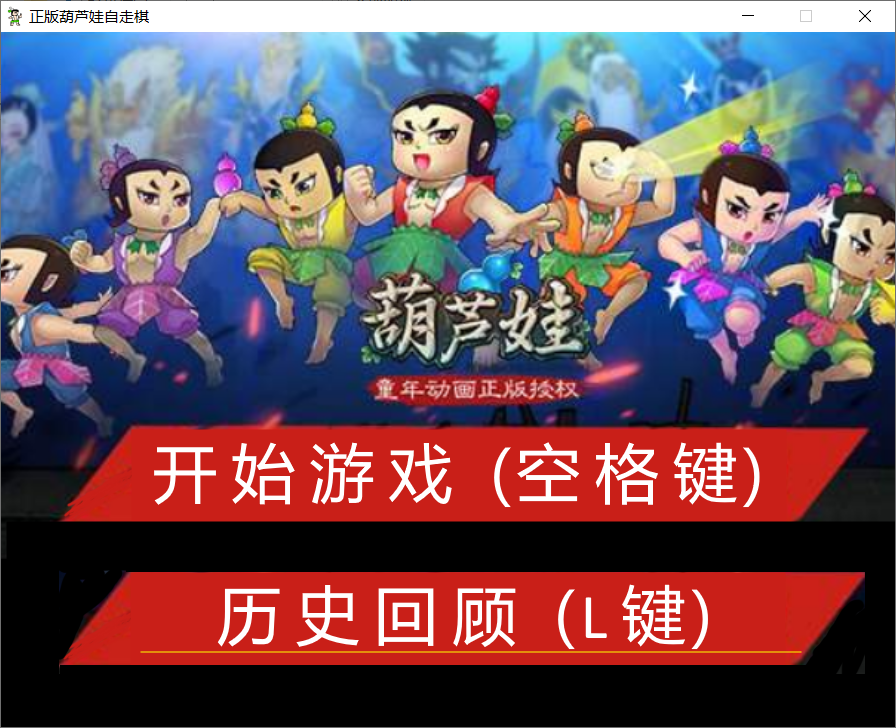
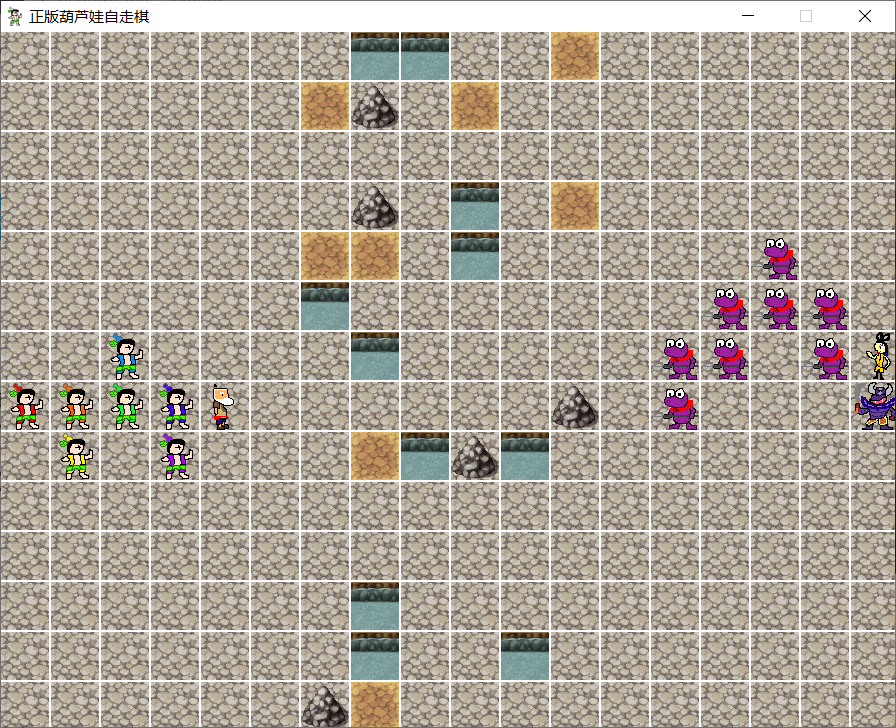
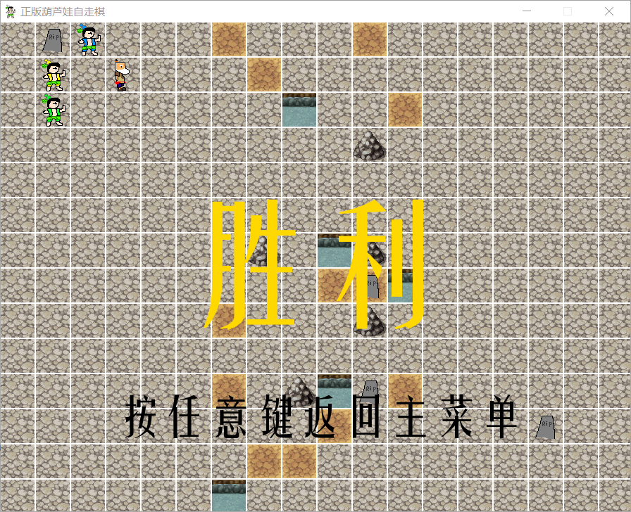
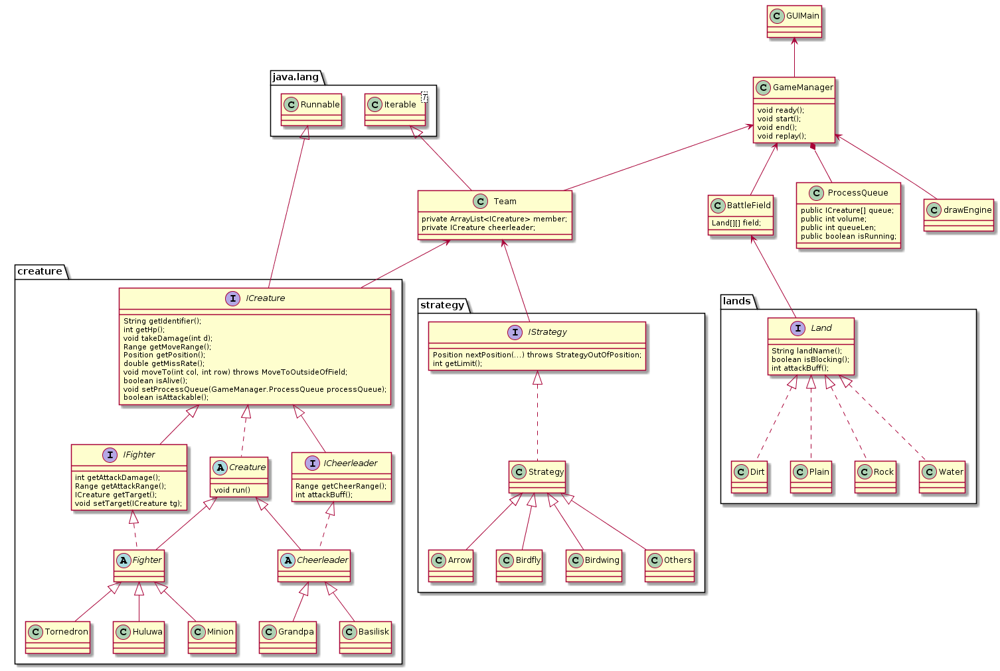

# Java 程序设计 期末大作业报告

## 游戏操作说明



游戏打开后，会看到两个可视按钮，点击按钮可以进行相应操作。同时，主界面按下Q键或点击右上角X可以退出游戏。

开始游戏后，游戏自动生成两组队伍，并且自动生成随机地形，再次按下空格键即可让单位自行移动。



当某一方胜出或达到最大回合数，游戏结束，显示结束画面，此时按任意键可返回主菜单。




## 游戏设计

在游戏开始时，游戏初始化战场，并随机生成一些地形。不同的地形有不同的作用：

* 石头地面：光滑的地面。无特殊效果。
* 泥土地面：非常柔软，踩在上面很舒服，所以揍人也更加有力了。加强攻击力。
* 水坑：水中活动受限，很累，所以揍人更加无力了。减少攻击力。
* 石头堆：由于所有人都不想爬石头山，所以大家都绕过去。无法移动在此单元格。

不同的地面有不同的生成几率。


游戏分为两队，每一队在游戏开始前随机摆阵。按下空格键后，大家开始行动。每个生物都有以下属性：

* 血量：当血量为0时，天上会掉下一块墓碑将其埋葬。
* 移动范围：有些人跑得比较慢，有些人跑得比西方记者还快。
* 闪避率：敏捷的人可以闪过别人的攻击。

而战斗单位有以下独特属性：

* 伤害距离。有些人巴掌大但是短，有的人力气小但是射得高。

加油单位则有以下属性：

* 加油距离和加油效果。当葫芦娃看到爷爷在身边，揍人也更加有力了。


单位的行动逻辑参考了《三国志：曹操传》。

当轮到战斗单位移动时：

* 选取最近的敌对单位，并接近该单位。
* 移动完毕后，试图攻击该单位。
* 攻击时会参考攻击单位攻击力、被攻击单位闪避率、地形加成、加油加成。
* 当被攻击单位死亡，留下一块墓碑。

当轮到加油单位移动时：

* 计算出一次能为最多队伍成员加油的区域，也就是人多的地方。
* 试图移动到该位置。
* 如果队伍成员全部死亡，试图逃跑。


游戏结束的判断条件：

* 若某一方队伍全部死亡，则另一队获胜。
* 如果达到了最大回合数，算葫芦娃胜利。


游戏单位的素材均是自己绘制的。

## 代码设计及理念

### 代码结构解析

在主类中，将启动JavaFX线程。JavaFX线程打开时，侦听鼠标点击事件和键盘按下事件，并执行对应的操作。

同时，主类中维护一个GameManager类，它为主类提供状态转移的判断条件：

* 主界面状态 -> 开始游戏 / 读取文件
* 开始游戏 -> 等待空格键按下 -> 游戏执行到结束 -> 等待任意键按下 -> 主界面状态
* 读取文件 -> 成功读取 -> 执行回放到结束 -> 等待任意键按下 -> 主界面状态
* 读取文件 -> 没有读取到文件 -> 主界面状态

当试图进行游戏时：

* 初始化战场类对象，两边的队伍及布阵策略。
* 每个队伍新增ICreature类成员，在新增成员时根据布阵策略获取位置。
* 调用drawEngine类对象绘制战场和成员。
* 等待空格按下。

当空格按下时，执行回合：

* 所有成员抢占GameManager的内部类ProcessQueue类对象，试图加入处理队列。
* 当队列满时，依次处理队列内成员，并调用drawEngine绘图与记录。处理完进入回合结算。
* 如果回合数达到最大或某队伍所有成员死亡， 则游戏结束。

当回放进行时：

* 从文件中读取日志文件，直接调用drawEngine进行绘制。
* 使用Timeline进行回放。


## 类图

本图主要介绍代码结构，部分具体的方法和成员名称为节省篇幅而省略，详见代码本体。




## 设计理念

### 面向对象

* 封装：在整个游戏设计中大量地运用到了封装，玩家只需要调用接口即可获得对象的服务。与此同时，只需要实现了接口就可以参与到游戏中，提高了游戏组成部件的可扩展性。
* 继承：同时继承也体现在游戏设计中。如生物的很多功能，包括判断是否存活等，内部逻辑其实是完全相同的。通过一个统一的Creature类实现这些共有功能，再让其他生物继承Creature类，就可以高效地进行代码复用。
* 多态：由于接口的存在，多态思想的利用十分普遍。例如，无论是怪物还是葫芦娃，只需要`Arrays<ICreature>`就可以储存，不需要另外单独地去为这两种不同生物建立相应容器。

### 异常处理

* 因为代码中使用到了很多其他包的功能，而这些功能会抛出指定异常，因此程序中会强制地用try...catch块去捕捉这些异常。

* 同时，游戏中还自定义了一些异常，用于调试程序正确性以及作为程序结束的辅助判断。例如，为队伍添加成员时，会耗尽所有可用的布阵栏位。当试图继续获取栏位，布阵策略类会抛出无可用栏位的异常。这时候通过捕捉这个异常来让获取过程结束。

  ```java
  // IStrategyTest.java
  try{
      for(int i:range(20)){
          tmp = strategy1.nextPosition(Utils.DIRECTION.TO_BAD, new Position(7,0));
          assertTrue(0<= tmp.col() && tmp.col() < GRID_HEIGHT && 0<=tmp.row() &&tmp.row() < GRID_WIDTH);
      }
  }catch (StrategyOutOfPosition e){}
  ```

### 集合类型

* Java 当中提供了很多的集合类型，不同的集合类型有不同的功能，这让我们不需要基于数组创建各类容器。
* 在游戏的实现中更多地还是利用了ArrayList去维护一个顺序容器。ArrayList比数组更优越的地方在于它可以根据实际需求动态改变长度。
  * 例如，每一回合的单位动作总量是会变化的，此时如果用一个长数组去储存该回合的单位动作显然不太合适，这时候我们就使用`ArrayList<MoveRecord>`来存储。

### 泛型机制

* 关于泛型，由于在设计中不是很多需要一个能处理通用类型的工具，或者通用类型本身没有写成泛型的必要，因此某些用于数据传递的类，没有采用自定义泛型的方式来写，而是具体写为固定类型的类。
* 游戏使用了泛型机制的地方有两个。其一是二元元组类Pair<K, V>，封装在Position类的内部。其二是ArrayList的类型定义上。

### 自省机制

* 动态获取对象类型并生成实例：在GameManager的初始化阶段，两边队伍需要各安排随机的阵法。但如果仅仅是新建一个数组去保存所有的阵法，那么有可能因为两边选择了同样的阵法而导致栏位不足。此时就通过动态生成阵法类型的实例，使得两边队伍使用的阵法图不同。

  ```java
  ret = strategies.get(random.nextInt(strategies.size())).getClass().newInstance();
  ```


### 设计原则与设计模式

在本项目中充分考虑了SOLID原则。

* Single-Responsibility Principle：单一职责原则要求引起对象改变只能有单一的原因，不能在不同的逻辑下都分别引起同一对象的变化。在本项目中，不同的功能都被独立到同一模块中，如战场类负责战场管理，绘图类负责界面更新。
* The Open-Closed Principle：开放封闭原则要求软件实体易于扩展的同时无需修改源代码。通过接口，本项目极好地实践了这一原则，例如阵法和地块通过相关接口被外部调用，而需要扩展更多阵法的和地块仅需实现接口，不需要修改其它的接口和类。同时，某些记录式结构体采用硬性定义的方式确定其数据结构，没有为了抽象而抽象地使用泛型。
* The Liskov Substitution Principle：Liskov替换原则要求使用基类不能假设用户能够了解基类的派生类情况。本项目的原型曾违反了这一守则，使用RTTI检查类型来判断队伍。后来这一错误设计通过在队伍类新增方法，得知队伍是否包含该成员所替代。
* The Interface-Segregation Principle：接口分离原则要求客户在使用接口时仅依赖其调用的方法。本项目将单位分为两类，一类是战斗者，一类是加油者。这两者有不同的功能（比如加油者没有攻击范围等属性），不应该耦合在一起。所以设计中这两类单位有各自的接口，设计单位时要选择其中一个来继承。
* The Dependency-Inversion Principle：依赖倒置原则要求高层模块不应该依赖于具体的底层模块实现，而应该使用抽象接口来进行两者之间的沟通。本项目中大量使用到接口，很好地实现了高层模块与底层模块对抽象的依赖。

本项目也运用了多种设计模式。

* 迭代器模式：Team类可以通过foreach对队伍内成员进行遍历。
* 装饰器模式：在日志文件IO上就运用了装饰器模式。
* 观察者模式：GameManager会观察队列情况，当队列满时开始处理当前回合。
* 模板方法模式：每个生物都有自己独特的属性，这些属性可以通过接口被获取。此外新的葫芦娃也可以通过外部给定的参数进行定义。
* 工厂模式：阵法类的`nextPosition()`会不断地对外提供新的栏位位置，队伍新增成员时可以得知应该插入到哪个位置。

### 多线程

* 在游戏开始时，每一个生物被建立，但是还没有装载入Thread中执行start。当玩家再次按下空格之后，线程才会开始执行。
  * 调试过程中偶发线程start失败的情况，为保证所有生物线程都start完毕，Thread会放在一个ArrayList中，然后放在循环中尝试start。只有所有线程的isAlive都为true的时候才开始监听队列。
* 实践过程中，会发现线程执行完毕后再次抢占到线程的情况。为了避免某个线程行动次数过多，采用了回合制的设计。当轮到某个线程执行的时候，该线程不停地尝试synchronized队列对象。若成功加锁，则让自己加入队列，并让自己处于wait状态。
* 为了实现监听队列情况，不能使用while true循环对线程进行轮询，否则主线程会阻塞所有线程的执行。实际设计中，是通过自定义监听属性PropertyChangeSupport来进行队列状态检查。当队列满时，按照顺序处理队列中的对象，并在最后使用notifyAll来唤醒所有线程。
* 由于画面更新发生在所有线程的阻塞过程中，因此不必担心JavaFX线程不安全的问题。

### GUI

本项目的GUI部分使用了 JavaFX 框架，这是目前最流行的Java GUI框架，可以提供强大的GUI支持。

* 游戏主要通过画布绘制的方式呈现游戏内容，通过统一在drawEngine.drawPic中，调用GraphicsContext.drawImage()来完成游戏画面的刷新。
* 回放使用了Timeline类进行绘制，通过使用lambda表达式设置关键帧，使得不必先把所有记录内容读取到内存再进行绘制，减轻了内存开销压力。

* GUI编程的难点在于其并不是单线程作业，而是拥有一个JavaFX Application线程，在这个线程中会不断地执行监听和画面刷新的操作。因此在drawEngine里同样配置了一个PropertyChangeSupport来监听绘图请求。

### 注解

Java 中的注解可以提示编译器应该对被注解的数据或方法进行什么样的处理。而处理时需要通过反射的方式获取注解信息并才能继续处理。

本项目主要采用已有的注解，包括用@Override覆盖父类方法，用JUnit的@Test标注测试方法行为等等。

### 输入输出

游戏的文件输出采用的文件名是时间戳+.log后缀的形式。

具体采用的输入输出方式是ObjectInputStream/ObjectOutputStream对绘图记录类对象DrawRecord进行输入与输出。

输入输出时采用了修饰器模式创建相应的对象，如ObjectInputStream的创建：

```java
ObjectInputStream reader = new ObjectInputStream(new BufferedInputStream(new FileInputStream(filename)));
```


此外，资源管理也是输入输出的其中一个要点。在项目中直接使用不带路径的文件名作为创建Image对象的url是可行的，然而打包为jar之后将无法正确加载资源图片。正确做法应该是使用getResource方法。具体来说：

```java
new Image(this.getClass().getClassLoader().getResource("Main.png").toString())
```


日志文件的选择，使用的是JavaFX的FileChooser。当文件返回了null时，说明没有选择任何文件，游戏将不会进行回放操作。

### 测试

单元测试使用了JUnit4组件进行测试类的编写。每个测试方法都附上@Test标注其测试属性。

* 对于可能会发生异常的情况，编写触发异常的语句，并通过fail语句来提示测试失败。
  * 例如，调用ICreature接口中的moveTo方法移动到了地图之外时，应该触发MoveToOutsideOfField异常，这时候注解更改为@Test(expected = MoveToOutsideOfField.class)。
* 对于返回值的监测，使用JUnit的assertTure, assertEqual等方法进行断言。

### 构建

项目使用maven进行构建管理，只需要执行`mvn clean test package`即可将文件打包为.jar文件。

使用如下命令可以执行jar文件进行游戏：

```java
java -cp <jar文件名> Main
```


## 作业感想

大作业编写是一次艰难的过程，也是有收获的过程。

Java课不仅教会了我们面向对象的语法，更重要的是还有许多其他方面的知识，比如单纯的语法课不会教授的设计原则、设计模式等知识内容。在大作业中，我们发现这些设计方法并不是空穴来风，应用它们确实可以减轻我们的设计负担。

当然，这是第一次将所有的GUI、多线程等各种高级语言中的内容结合在一起形成一个完整项目，肯定还有Naive的程序代码和设计模式、框架存在，但有了这一次的经验，相信下一次的开发一定能更加成熟。


